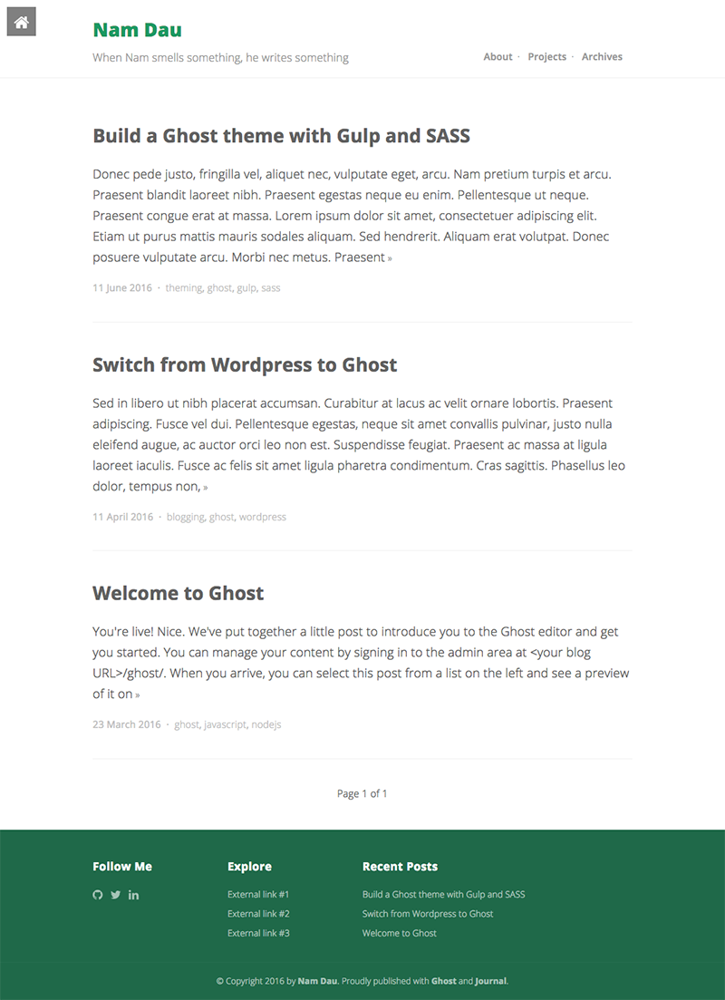

# Journal

**Journal** is a minimal responsive theme for [Ghost](http://github.com/tryghost/ghost/) which focus on content and features syntax highlighter from [Prism](http://prismjs.com/).

I'm using this for my [blog](http://namdau.com/).

## Getting Started
You'll need to have `npm` (bundled with [node](https://nodejs.org/)) and [gulp](http://gulpjs.com/) installed and follow these steps to clone the repository, install all necessary packages and build the assets:

	cd /your-ghost-blog/content/themes
	git clone https://github.com/namdau/journal
	cd /your-ghost-blog/content/themes/journal
	npm install

## Configuration
### Social links
Open `partials/social.hbs` and replace these with your social links

	<li><a href="#"><i class="fa fa-lg fa-github"></i></a></li>
	<li><a href="#"><i class="fa fa-lg fa-twitter"></i></a></li>
	<li><a href="#"><i class="fa fa-lg fa-linkedin"></i></a></li>

### External links
Open `partials/external.hbs` and replace these with your external links

	<li><a href="#">External link #1</a></li>
	<li><a href="#">External link #2</a></li>
	<li><a href="#">External link #3</a></li>

### Google Analytics
Open `default.hbs` and find this line

	ga('create','UA-XXXXX-X','auto');ga('send','pageview');

Replace `UA-XXXXX-X` with your Google Analytics ID

### Disqus
Open `post.hbs` and find this line

	var disqus_shortname = 'example_shortname';

Replace `example_shortname` with your Disqus shortname

## Development
**Journal** uses [gulp](http://gulpjs.com/) as build system and [browser-sync](https://www.browsersync.io) to support synchronised browser testing and live reload, all assets are located at `src` directory and build output is set to default `assets` directory.

Fire up your terminal and run these commands before you start making changes:

	cd /your-ghost-blog/content/themes
	npm install
	gulp

## Copyright & License
[MIT license](LICENSE)
